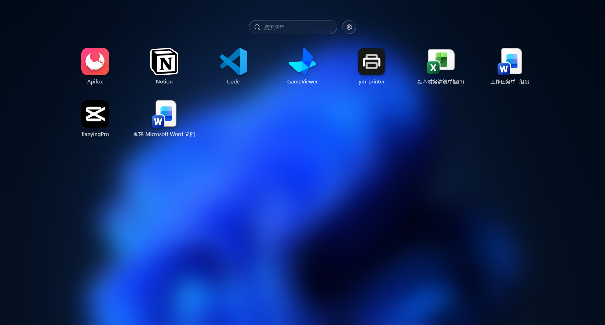

  

  <h3 align="center">Ym Launcher</h3>

  

    Ym Launcher 是一款专门为windows开发的应用启动台
     
     
    <a href="https://gitee.com/zmy-devs/ym-launcher/releases">
    Gitee
    </a>
    &middot;
    <a href="https://github.com/zmy-devs/ym-launcher">
    Github
    </a>
    &middot;
    <a href="https://github.com/zmy-devs/ym-launcher/blob/main/docs/release-note.md">
    更新内容
    </a>
  

## 功能

- 导入本地应用或快捷方式，一键打开常用软件。
- 支持应用名称与拼音搜索，快速定位目标应用。
- 支持拖拽排序、跨页整理；将应用拖到另一应用上即可创建分组。
- 支持重命名、删除应用和管理应用分组。
- 自动读取系统壁纸，并可调整背景高斯模糊和遮罩强度。
- 可自定义桌面行列数量、图标尺寸和多页切换。
- 支持启动、隐藏、上一页、下一页等快捷键；可用鼠标热角快速唤起。
- 内置更新检查与自动更新配置。

## 界面预览

## 下载 Ym Launcher

<a href="https://gitee.com/zmy-devs/ym-launcher/releases/latest">
使用Gitee下载
</a>

<a href="https://github.com/zmy-devs/ym-launcher/releases/latest">
使用Github下载
</a>

## 许可证

本项目采用 [GPL-3.0-or-later](./LICENSE) 许可证。
